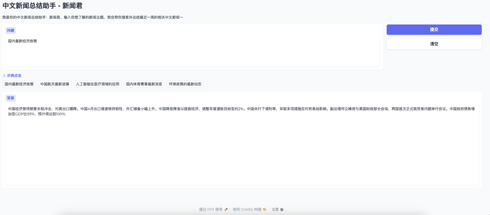
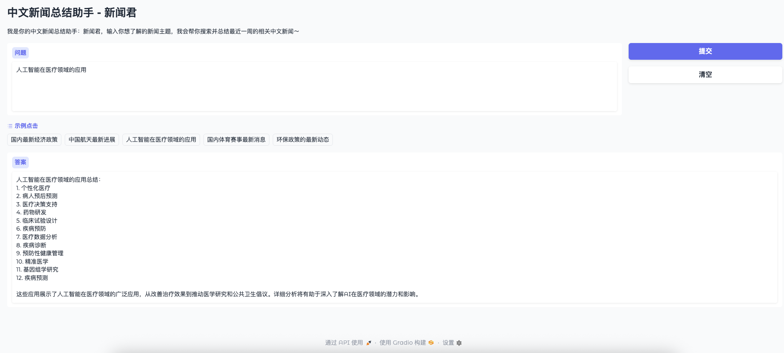

# 中文新闻总结助手 - 新闻君

基于AutoGPT和Gradio开发的中文新闻自动搜索与总结工具。该工具能够搜索近期中文新闻、爬取内容并生成总结，为用户提供快速便捷的新闻信息获取服务。

## 示例截图





## 核心功能

- **新闻搜索**：自动搜索最近一周的中文新闻
- **网页爬取**：智能爬取新闻网页内容，并进行初步清理
- **内容总结**：使用AI进行新闻内容总结，限制在300字以内
- **友好界面**：基于Gradio构建的简洁直观的用户界面

## 技术架构

- **LangChain**：提供AutoGPT、工具链和向量存储功能
- **OpenAI**：提供语言模型支持
- **Gradio**：提供Web界面
- **FAISS**：高效的向量检索库
- **BeautifulSoup**：网页内容解析

## 安装指南

### 前提条件

- Python 3.8+
- OpenAI API密钥

### 安装步骤

1. 克隆或下载此项目

2. 安装依赖包
```bash
pip install -r requirements.txt
```

3. 设置OpenAI API密钥
```bash
export OPENAI_API_KEY="your-api-key"
```

## 使用方法

1. 启动应用
```bash
python autogpt.py
```

2. 在浏览器中访问提示的URL（通常是 http://127.0.0.1:7860）

3. 在输入框中输入你想了解的新闻主题，例如：
   - 国内最新经济政策
   - 中国航天最新进展
   - 人工智能在医疗领域的应用
   - 国内体育赛事最新消息
   - 环保政策的最新动态

4. 点击"提交"按钮，等待AI处理并生成结果

## 实现细节

- **自动文件管理**：每次提交请求时自动清理旧的结果文件
- **错误处理机制**：完善的异常捕获和错误信息记录
- **新闻源优先级**：对中文新闻网站进行了优先级排序，确保获取权威信息
- **每次会话独立**：每次查询都会创建新的AutoGPT实例，避免历史信息干扰

## 接口说明

该应用提供以下工具接口：

- **news_search**：搜索最近一周的中文新闻
- **web_crawler**：爬取指定URL的网页内容
- **news_summary**：总结新闻内容，限制在300字以内
- **WriteFileTool**：将内容写入文件
- **ReadFileTool**：读取文件内容

## 注意事项

1. 使用前请确保设置了有效的OpenAI API密钥
2. 搜索结果依赖于SerpAPI的返回内容
3. 爬取功能可能受到目标网站反爬措施的限制
4. AI生成的内容仅供参考，可能存在不准确之处

## 扩展与优化方向

- 支持更多新闻源和语言
- 增加新闻分类功能
- 添加定时任务，自动推送热点新闻
- 优化网页爬取逻辑，提高内容提取准确率
- 增加用户个性化设置，如关注主题、偏好新闻源等

---

开发者: panjuncai
版本: 1.0.0  
